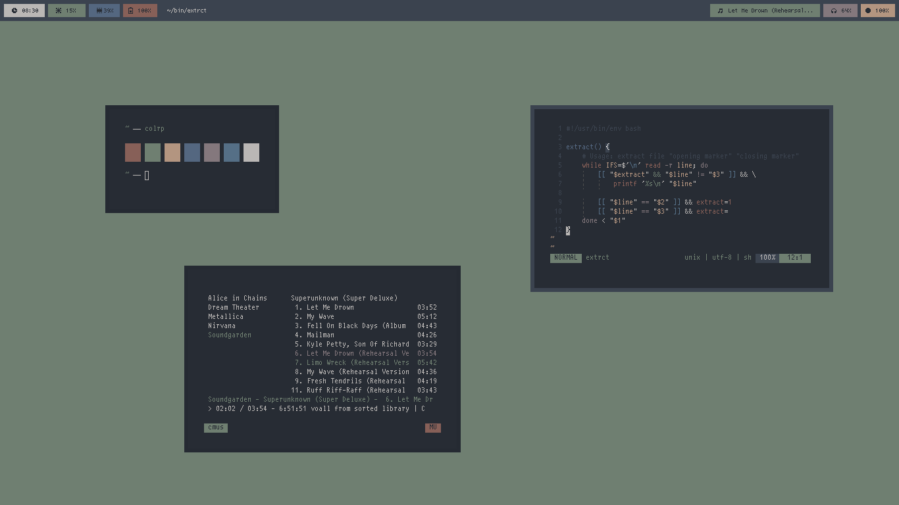

<h1 align="center">dotfiles ❤ ~/</h1>

##### scrots
#####[skigh](https://github.com/dkeg/crayolo/blob/master/colors/skigh)

# pavan's dotfiles

Uses Git [subtree][] and submodules to keep my dotfiles in one place
in an elegant manner. With inspiration from [xero][], uses [GNU Stow][]
to symlink files one folder deep to the folder above.

[subtree]: https://github.com/git/git/blob/master/contrib/subtree/git-subtree.txt
[xero]: https://github.com/xero/dotfiles
[GNU Stow]: https://www.gnu.org/software/stow/

# tools

Other tools to install:

- [2bwm](https://wiki.archlinux.org/index.php/2bwm) : A fast floating WM
- [polybar](https://github.com/jaagr/polybar) : A fast and easy-to-use tool for creating status bars.
- [rxvt-unicode](https://wiki.archlinux.org/index.php/rxvt-unicode) : customizable terminal emulator
- [neovim](https://neovim.io/): the future of [vim](https://twitter.com/nelstrom/status/881813223997153280)
- [zsh](http://www.zsh.org/): shell designed for interactive use
- [Git](https://git-scm.com/) (and [hub](https://hub.github.com/)): VCS
- [tmux](https://github.com/tmux/tmux): terminal multiplexer
- [Firefox](https://www.mozilla.org/en-US/firefox/): browser

## thanks

I actively watch the following repositories. :)

* [eti0/dots](https://github.com/eti0/dots)
* [NerdyPepper/dotfiles](https://github.com/NerdyPepper/dotfiles)
* [JLErvin/dotfiles](https://github.com/JLErvin/dotfiles)

## Resources

* [GitHub ❤ ~/](http://dotfiles.github.io/)
* [archwiki](https://wiki.archlinux.org/index.php/Dotfiles)
* [GNU Stow](https://www.gnu.org/software/stow/)
* [xresources](https://wiki.archlinux.org/index.php/x_resources)
* [orgainizing xresources](https://www.reddit.com/r/unixporn/wiki/organizing_xresources)
* [ricing](https://www.reddit.com/r/unixporn/wiki/ricerous_info)
* [/g/ wiki on ricing](https://wiki.installgentoo.com/index.php/GNU/Linux_ricing)

## additional links

* [suckless](https://github.com/pavanjadhaw/suckless)
* [scripts](https://github.com/pavanjadhaw/bin)
